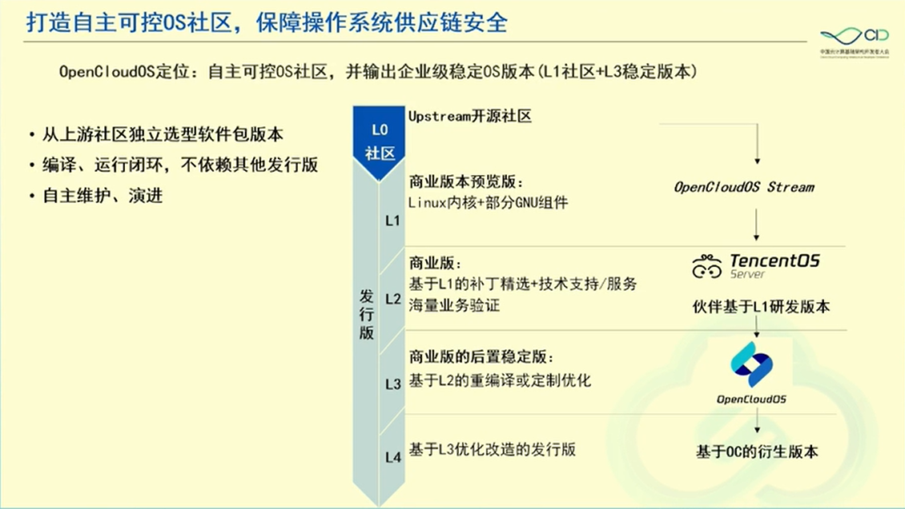
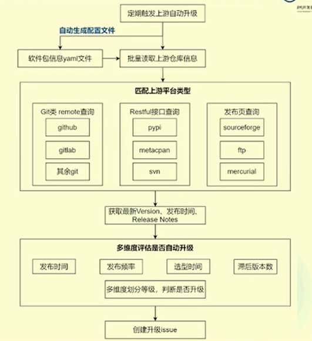
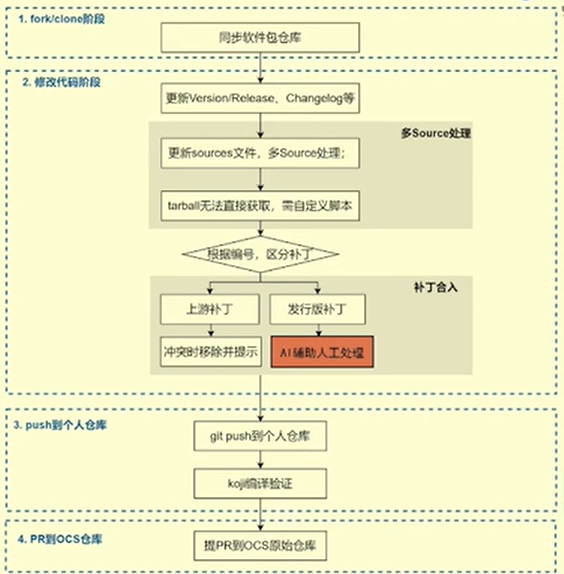

# 自维护基础设施与 AI 应用

第五届中国云计算基础设施开发者大会 
智能云基础设施分论坛 2024.10.19

报告人：赵振

## 背景

Linux 发行版自主维护挑战巨大：软件包规模大、涉及领域多，进行自主维护，对人力、能力都有很高的要求。

因此构建了一套全流程的自动化维护设施来提高维护效率。

## `rpm-upgrade`

问题/需求：

- 上游社区平台协议、接口形式多样；
- 版本发布频率、选型间隔不同，需要综合考虑是否触发自动升级；
- 多 source 源、tarball 无法直接获取的情况多；
- 升级后补丁冲突问题；

`rpm-upgrade` 效果：

- 主流平台 git/svn/pypi/perl 等均覆盖；
- 3200+软件包自动化跟踪，覆盖率 98.5%;
- 每个包较人工平均节省 10 min 以上；
- 补丁自动解决率 85% 以上；
- 软件包升级效率提升 80% 以上；

## `rpm-tracker`

自动给软件包打补丁。

问题/需求：

- 软件分支、commit 信息多，传统 git clone 方式耗时长；
- 主要关注 bugfix、cve，需要对 commits 进行分类，人工费力、关键词匹配方式不准确；

解决方案：

- 适配 python 的 GraphQL API 爬取上游 commit 信息；
- 选择合适的大模型，结合微调，对 commit 进行推理，自动分类；
- 爬取后自动提交 PR；

打补丁失败，补丁冲突如何解决？

- 行号漂移、新值插入、语素变动等异常导致补丁应用失败；
- 需要理解代码语义，才能修改补丁重新适配，过去机器在这上面的工作有限；
- 适配补丁后可能出现新问题；
- 利用大模型与自动化维护基础设施的有机结合，理论上可以解决上述问题；

## `rpm-check`

兼容性检查，软件包变更的守门人

问题/需求：

- 现有开源工具无法覆盖部分主流语言，特殊库名、符号等无法处理；
- 难以判断符号变化是否产生对外影响，影响范围评估不准去；
- 软件包库数量多、体积大，检查和搜索耗时长；
- 软件包执行文件输出复杂，通过代码很难覆盖所有场景；
- 兼容性检查结果较复杂，部分场景较难直接判断是否兼容；
- 兼容性结果不易理解，开发者分析差异、适配应用成本高；

效果：

- 支持 C/C++/Python/JAVA 等主流语言，特殊场景基本覆盖；
- 从符号粒度确认影响范围，精确度 90% 以上；
- 包及文件粒度并发，本地缓存缩短检查以及符号搜索耗时 50% 以上；
- 加入大模型分析能力，降低了 30% 以上的可执行文件差异误报率；
- AI 修正了 10% 的兼容性结果，提高了差异报告的可读性；
- 按照实际操作顺序知道开发者进行问题排查和修复；

## `rpm-dep`

查询包依赖与排序。

问题/需求：

- 现有工具无法快速获取多层的受影响包列表；
- 受影响包之间也存在依赖关系，需要排序；
- 不同变更项，影响和风险不同，重编策略不同；
- 重编需要按依赖层级构造编译环境；

效果：

- 多种依赖场景秒级查询多层依赖树；
- 包排序指导按依赖层级进行构建；
- 重编精准，无遗漏无冗余release+1；
- 按依赖层级编译、构造编译源，编译依赖新包
- 人工只需确认，效率提升100%；

## 利用大模型进行 review

让大模型参与PR的review，减少maintainer在低级问题上花费的时间，聚焦代码逻辑问题，提升review效率;

给出PR的大模型总结;
找出不符合打包规范、代码贡献要求的部分;
找出可能潜在的风险项(如Iicense不合规)。
