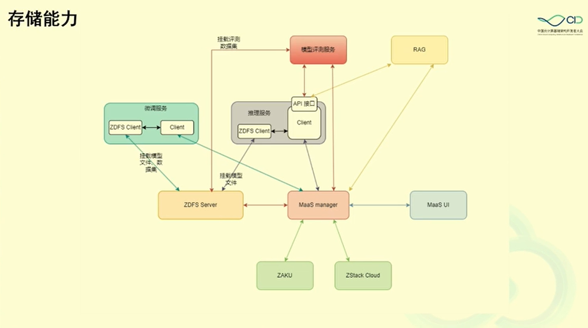

# 云平台到 AI 原生平台的升级之路

第五届中国云计算基础设施开发者大会 
智能云基础设施分论坛 2024.10.19

报告人：王为、刘磊

## 背景

ZStack 是一家从做私有云、混合云起步的产品公司，从 2015 年到现在，一直深耕于云平台软件，在虚拟化的基础上，从计算、存储、网络、平台几个维度不断扩展产品的功能和稳定性。

云平台的整个架构最早是围绕虚拟化的，后来也延伸了裸金属和容器的管理，但整体的思路依旧是以虚拟化为中心。

## AI 业务的特征和需求

### 传统以虚拟化为中心的云平台的几个特征和需求

- 底座：对宿主机进行管理，监控，运维，资源管理等等。

- 数据：对象存储等等。

- 通信：虚拟网卡、弹性 ip、负载均衡等等。

- 安全

- 运维

- 运营

### 传统业务和 AI 业务的对比

|      | CLOUD-INFRA                  | AI-INFRA                               | 变化                                                         |
| ---- | ---------------------------- | -------------------------------------- | ------------------------------------------------------------ |
| 通信 | 虚拟网卡                     | NVLink/PCIe/RDMA/IB                    | 分布式训练需要非常大的通信带宽和通信延迟，在这种场景下优先采用 NVLink 和 PCIe Switch，在单机无法满足的情况下通过 RDMA via IB/RoCE 通信。 |
| 安全 | 机密计算、加密磁盘、网络安全 | 数据安全、模型安全、生成合规、版权保护 | 需要有限考虑保护数据和模型的资产安全性，采用加密、监控等方法，对业务往往具有一定的侵入性。生成的合规性和版权保护可以不侵入业务，采用外层保护的方法，通过敏感词、意图的监控、在线水印等方法防止恶意使用。 |
| 底座 | 宿主机                       | 虚拟机或容器                           | GPU 的故障率和价格高于 CPU，因此 AI 业务会非常关注 GPU 的状态，例如 GPU 的资源使用情况、GPU 的健康情况。由于 AI 业务和底层物理机还隔了一层虚拟化或容器，因此会有“双重调度”，特别需要注意 CPU 拓扑和 GPU 拓扑。 |
| 数据 | 块、文件、对象               | 文件、对象居多                         | 数据的来源、清洗、管理成为非常受关注的部分。块的重要程度有所降低。因为模型文件的巨大，存储缓存比较受关注 |

### 从 AI 业务的角度来看

**筛选模型**，目前 ModelScope 上有 4000 多个模型，Hugging Face 上有 620000 个模型，涉及多模态、计算机视觉、自然语言处理、音频生成等待类别。寻找合适的底座、合适的参数是整个项目成功的关键因素。

**规模训练和微调或者构建数据库**，筛选到合适的底座后需要进行规模训练和微调。例如做多模态内容检索，需要对大量素材生成向量并录入向量数据库，并且需要进行微调。训练时需要大量的算力和配套设施。

**适配部署**，部署时需要考虑所应对的请求数量，如果用户数量多、并发量大，可能需要很大的推理算力需求。

## 计算、存储与通信

### 计算能力

从计算范式上看， AI 业务最明显的特征就是计算中心从 CPU 转向了 GPU。Intel 2005 年发布的 VT-x 是 CPU 划时代的进展，它代表着虚拟化由纯软模拟转向了硬件辅助。随着 Intel、AMD 的数据中心 CPU 对虚拟化有了越来越好的支持 (VT-x、VT-d、EPT、VMCS、ACPIv、AVIC)，虚拟化的 CPU  效率和物理 CPU 相比已经不遑多让。

但是 GPU 的虚拟化则没有这么完善。目前有多种 GPU 虚拟化的方案：

- VGPU
- GPU Timeslicing
- MIG GPU
- MPS
- CUDA 劫持

为什么会有这么多的 GPU 虚拟化方案呢？

本质上是因为 GPU 的物理特性和工作方法所决定的。

首先看物理特性。GPU 显存的带宽远远大于内存的带宽，因此很多需要借助 CPU 或内存的 GPU 虚拟化方案，在内存带宽和显存带宽这一块的差异会很大。

再就是工作原理，由于 GPU 的核心工作是计算，而大模型的大量参数需要确保首先装载到模型，再上 GPU Context 的切换成本，导致大尺寸模型下“GPU 虚拟化”的价值很微弱，对于小尺寸模型或者低算力的场景下，还可以发挥一点作用。

ZStack 提供的 CUDA 劫持方案进行 GPU 虚拟化，同时在基础设施层面提供对 GPU 的故障监测和管理手段。

观测手段有：lspci、nvidia-smi/rocm-smi/efsmi、dmesg。

### 存储能力

| 业务     | 数据内容                                | 读写特征           | 读写频次                                   | 共享特征                                     |
| -------- | --------------------------------------- | ------------------ | ------------------------------------------ | -------------------------------------------- |
| 数据集   | jsonl、csv 等                           | 读为主，随机性较强 | 大部分场景读多写少                         | 需要共享，但也存在私有化数据集               |
| 模型仓库 | 模型参数，二进制文件                    | 顺序读或随机读     | 根据业务模式不同而不同，大部分情况读多写少 | 大部分情况需要共享，少部分情况需要私有化     |
| 模型镜像 | Qcow2、Docker镜像                       | 主要是分发为主     | 读多写少                                   | 基本以共享为主                               |
| 推理代码 | 文本格式代码                            | 数据量较小         | 读多写少                                   | 根据业务模式不同而不同，大部分情况以共享为主 |
| 模型微调 | 模型的 checkpoint，本质上和模型参数一样 | 顺序写             | 写多读少                                   | 共享较少                                     |
| 模型评估 | 数据集和评测日志                        | 顺序读，顺序写     | 读写均衡                                   | 共享较少                                     |

传统云存储主要是块存储，但是 AI 业务场景下，就需要更多考虑文件存储。ZStack 开发了一个 ZDFS 文件系统，形成了一个 POSIX 接口，模型参数、数据集等等都可以直接挂载到上面。

### 通信能力

- 机器内通信
  - 共享内存
  - PCIe
  - NVLink
- 机器间通信
  - TCP/IP
  - RDMA via RoCE
  - RDMA via InfinBand

机器间通信在训练场景更常见，包括梯度的传播、checkpoint 的保存等等。在大集群中更重要。

机器内通信在小集群中非常重要，尤其是推理场景中，没有那么多参数需要传递。这样的场景下对带宽要求不高，但是对延迟的要求比较高，而且多卡和单卡的性能影响不大。

## 总结

根据业务阶段的不同，分别规划 AI Infra 的业务需求，分析需求。

合理看待 GPU Share 技术，评估对业务是否有真正的帮助。

带缓存、支持共享的文件接口是目前 AI Infra 最青睐的存储方式。
